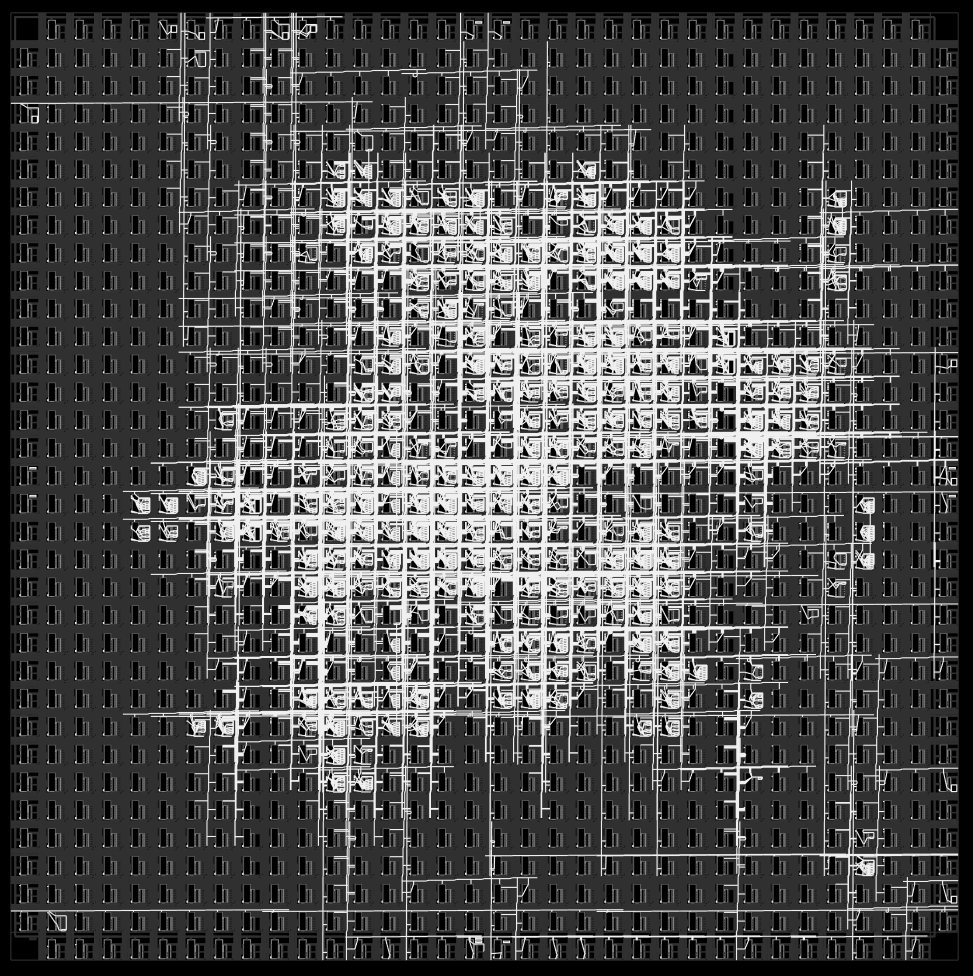
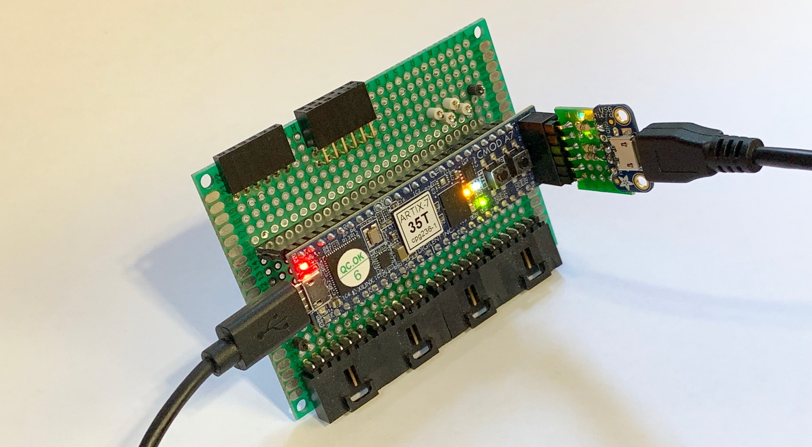
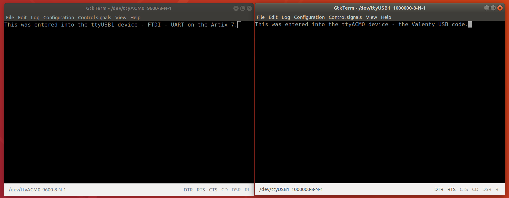
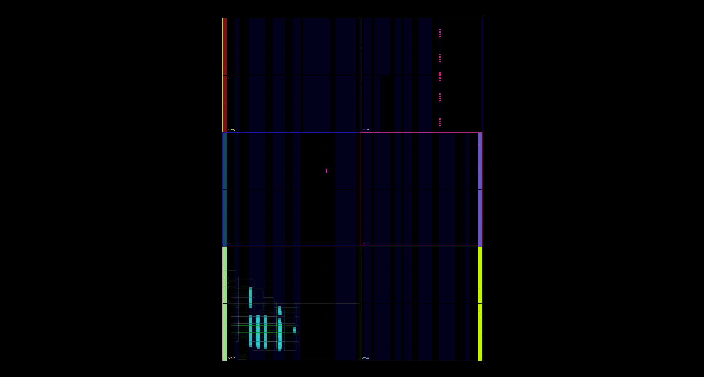
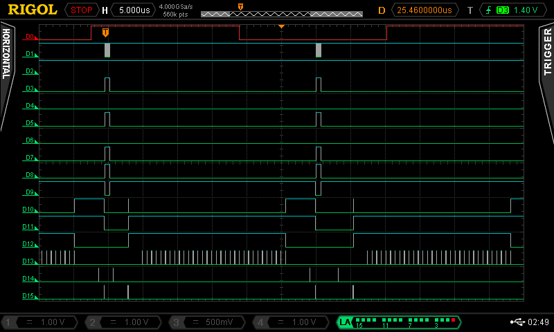

# TinyFPGA BX USB Serial


## Origins

Luke Valenti's USB module, as adapted by Lawrie Griffiths and others.  Luke's code was created with the purpose of providing a "bit banged" USB port to SPI bridge for his (awesome) TinyFPGA boards.

The original is here - https://github.com/tinyfpga/TinyFPGA-Bootloader

Lawrie Griffiths dug into the dark innards of this code and did the bulk of the work to change it to being a USB - SERIAL bridge, looking to the user like a serial port, rather than an SPI master.  He also created some great examples.  His work is here - https://github.com/lawrie/tiny_usb_examples

However there were a couple of problems:
- arachne-pnr would give spotty results, sometimes not working at all.  This is easy to understand when considering that arachne-pnr *does not place in such a way as to minimize timings!*  NextNPR is a must.
- the original code has a few places where it violates Verilog rules (mostly fixed by smunaut and submitted as a pull request https://github.com/tinyfpga/TinyFPGA-Bootloader/pull/21)

## This Project

This project makes the above changes, and fixes one or two other small issues.  Importantly, it also replaces the front end to the code with a pipeline interface, which is what makes this project more fork-y and less pull-request-y with respect to Lawrie's repo.

The key to the streaming pipeline interface is that there are three ports: `data`, `valid`, and `ready`.  A sender will place new data on the `data` port and raise the `valid` flag.  If a receiver is ready to receive, it will raise the `ready` flag.  So in any connection there will be two signals generated by the sender (`data` and `valid`) and one by the receiver `ready`.  And here's the key part *if `valid` and `ready` are both raised at the same time the data is considered to be transfered*.   This interface can clunk along - the sender raising valid now and then, and provided the `ready` signal is raised, data will flow, but pretty amazingly, this interface can really rock - if there is data to be had at every clock cycle, just leave `valid` and `ready` on and one word of data will flow *at each clock*.

This works pretty well and has been tested at full speed using some Python code.

The USB code alone (with virtually no other functionality at all) uses 14% of the device's LUT's.  Here's the NextPNR output:

```
Info: Device utilisation:
Info: 	         ICESTORM_LC:  1093/ 7680    14%
Info: 	        ICESTORM_RAM:     2/   32     6%
Info: 	               SB_IO:     9/  256     3%
Info: 	               SB_GB:     8/    8   100%
Info: 	        ICESTORM_PLL:     1/    2    50%
Info: 	         SB_WARMBOOT:     0/    1     0%
```

This code is passing timing.

```
Info: Max frequency for clock 'clk_48mhz_$glb_clk': 51.60 MHz (PASS at 48.00 MHz)
```

This is quite notable, since other adaptations of the Valenty code are forced to run most of the code in a much slower clock domain to pass timing.

Here's how the code is placed in the iCE40




**An Aside - Xilinx 7**

Since this is fully generic verilog code, there is no special work to do to make the code work in other architectures beyond instantiating the correct IO primitives.  Delightfully, this codebase also works on Xilinx parts.

The file `usb_uart_x7.v` is the wrapper that does the IO primitive work for Xilinx 7 code, so the primitives don't clutter the higher code.

With a little ad-hoc hardware (an [Adafruit USB mini breakout board](https://www.adafruit.com/product/1764), 68 ohm resistors connecting D+ and D- to FPGA IO, and a 1.5k pull up on the D+) a second port was added to a [Digilent Cmod A7 board](https://store.digilentinc.com/cmod-a7-breadboardable-artix-7-fpga-module/).



And connecting the soft usb to the onboard serial port results in a simple USB-USB bridge.



In contrast to the appearance of a 14% occupied iCE40, here's a 2% occupied Xilinx Artix 7 (20k LUTSs) running the simple SERIAL - Valenty USB bridge.



The wrapper code is included here and can easily be included in Xilinx 7 code that need a soft USB port, but the files for the above example are part of another to be soon released project.  The present experiment was performed in Xilinx's Titanic dev environment, [Vivado](https://www.xilinx.com/products/design-tools/vivado.html), but it might work in the open source [Project Xray](https://symbiflow.readthedocs.io/projects/prjxray/en/latest/).

**Interface**

The interface to the code looks like the following:

``` verilog
usb_uart u_u (
  .clk_48mhz  (clk_48mhz),
  .reset      (reset),

  // pins
  .pin_usb_p( pin_usb_p ),
  .pin_usb_n( pin_usb_n ),

  // uart pipeline in
  .uart_in_data( uart_in_data ),
  .uart_in_valid( uart_in_valid ),
  .uart_in_ready( uart_in_ready ),

  // uart pipeline out
  .uart_out_data( uart_out_data ),
  .uart_out_valid( uart_out_valid ),
  .uart_out_ready( uart_out_ready ),
);
```

Note that there are no baud rates, start, stop or parity specifications as this is only a pretend UART.

**Clock**

You will need a 48Mhz clock.  This can be generated by pll from the TinyFPGA BX's 16Mhz oscillator.

``` verilog
SB_PLL40_CORE #(
		.FEEDBACK_PATH("SIMPLE"),
		.DIVR(4'b0000),		// DIVR =  0
		.DIVF(7'b0101111),	// DIVF = 47
		.DIVQ(3'b100),		// DIVQ =  4
		.FILTER_RANGE(3'b001)	// FILTER_RANGE = 1
	) uut (
		.LOCK(locked),
		.RESETB(1'b1),
		.BYPASS(1'b0),
		.REFERENCECLK(clock_in),
		.PLLOUTCORE(clock_out)
		);
```

In this project, the pll is contained in its own module (pll.v) that is created by the IceStorm project tool `icepll`.

Amazingly, the 48MHz signal can also be generated by dividing down a faster clock.  Using an `icepll` configured pll at 192MHz, a 48MHz signal can be derived the simple way, by divider, and (possibly unnecessarily) put through the global buffer network for distribution.  This worked for a few experiments, but probably requires more development and testing to confirm.  Perhaps it can be done better.

``` verilog
wire clk_192mhz;
wire clk_locked;

// Use an icepll generated pll to give us 192MHz
pll pll192( .clock_in(pin_clk), .clock_out(clk_192mhz), .locked(clk_locked) );

reg [4:0] reset_counter = 0;

// Generate the slower clock
reg       clk_48mhz_logic;
reg [1:0] clk_divider;
always @(posedge clk_192mhz ) begin
    if ( ~clk_locked ) begin
        clk_divider <= 0;
    end else begin
        case (clk_divider)
            0: begin
                clk_48mhz_logic <= 1;
                clk_divider <= 1;
            end
            1: begin
                clk_divider <= 2;
            end
            2: begin
                clk_48mhz_logic <= 0;
                clk_divider <= 3;
            end
            3: begin
                clk_divider <= 0;
            end
      endcase
  end
end

// This clock has to go places.  Put it through a global buffer
wire clk_48mhz;
SB_GB gbc(
    .USER_SIGNAL_TO_GLOBAL_BUFFER (clk_48mhz_logic),
    .GLOBAL_BUFFER_OUTPUT ( clk_48mhz ) );
```

**Device Pins**

The pins in the interface to the module (`pin_usb_p` and `pin_usb_n`) are the raw device pins, the direction control logic is internal to `usb_uart_i40`.  The original usb_uart module is retained below to facilitate reuse in other architectures.

Somewhere the USB pull up pin has to be asserted.  This is done in the top level code, since usb_uart doesn't manipulate it.

``` verilog
assign pin_pu = 1'b1;
```

**Pipeline Interface**

There are two pipeline interfaces to the module, `uart_in` and `uart_out`.  The former being a pipeline *receiver* and the latter being a pipeline *sender*.  The naming can be a bit confusing.  `uart_in` is into the module, out of the device, into the host, `uart_out` is out of the host, into the device, out of the module.

These can just be tied together (as they are in this project) to create a UART loopback.

## Use

Development has been done on Ubuntu.

Clone the repo

```
git clone git@github.com:davidthings/tinyfpga_bx_usbserial.git
```

and enter the directory

`cd tinyfpga_bx_usbserial`

And make it!

`make`

The make process has got to do a few things so it may take a minute.

If it completes successfully, press the "program" button on the TinyFPGA BX and program it

`make prog`

If all went well, you will then see a new port which you can connect to with a serial terminal emulator (on Ubuntu the port is /dev/ttyACM0 and a good terminal program is **gtkterminal** since it doesn't seem to get upset if you forget to disconnect before reprogramming).

For this demo, characters typed are rather unspectacularly just echo'ed back.

`make gui`

Let's you perform the place and route manually and generate pretty pictures like the ones above.

## Dependencies

Nothing is required beyond the usual tools needed for TinyFPGA development.  This is a command-line makefile project.

**Icestorm**

http://www.clifford.at/icestorm/

Make sure you get NextPNR.

**TinyFPGA BX**

https://tinyfpga.com/bx/guide.html

## Debug

There is some debug instrumentation left in the code.  This will just disappear if you don't use it.  For the Device Host bug, there were 16 lines connected to the hardware to present as much state as possible from the USB stack for debugging.  Here's one resulting screenshot where the interface is working to near capacity.



- D0 - trigger (to send a 40-ish byte block if the last one was done)
- D1 Pipeline Data[ 0 ] (toggles when presented with a sequence of odd-even data)
- D2 Pipeline Valid - there is data available
- D3 Pipeline Ready - the data can be accepted
- D4 USB SERIAL IN State Machine[0] - controlling the pipeline from FPGA to Host (usb_uart_bridge_ep.v)
- D5 USB SERIAL IN State Machine[1]
- D6 `in_ep_data_done` (asserted when a partial outgoing buffer should be sent)
- D7  `in_ep_data_free` (asserted while the usb serial sysyem can accept data)
- D8 - EP State Machine[0] - `current_ep_state` (usb_fs_in_pe.v)
- D9 - EP State Machine[1]
- D10 - IN TX State Machine[0] - `in_xfr_state` (usb_fs_in_pe.v)
- D11 - IN TX State Machine[1]
- D12 - Bytes available to Tx - this indicates that there are bytes to send the USB transmitter
- D13 - Byte to Tx - this is the strobe of the next byte into the USB transmitter
- D14 - Receiver Message Start - the USB receiver has received a message start (an IN token or Ack here)
- D15 - Receiver Message End - the USB receiver has received a message start (an IN token or Ack here)

Overall, you can see the data source pipelining data (D1) into the buffer whenever the USB port is ready (D3).  When a buffer is full, the interface waits (EP State Machine D9,D8 = 1,0) until it gets an IN Token (D14,D15).  When this happens, the waiting buffer is sent as fast as the USB lines can send send them.  The interface waits for an ACK (D14,D15) and when all is well, signals up the stack that it's ready to fill another buffer.  And the cycle restarts.

## Issues

**Pipeline Interface**

Run slowly, the pipeline is pretty simple.  Data is available (`valid`), receiver (signaling `ready`) receives it.  Wait.  Repeat.  You can certainly use it in a simple way by de-asserting `ready` every cycle forcing the interface into a two step (`valid` `ready`, `valid` `~ready`).  The logic to do this is pretty simple.

Where the pipeline shines is when data is streaming - one in, one out every clock cycle, (as happens in multibyte transfers), but for a simple seeming interface, and one that appears in near all FPGA code, a pipeline like this can be *fiendishly* complex to implement, especially for modules in the middle of a pipeline.  Implementers *must* have a firm grasp on their `=`'s vs `<=`'s, know their `always @(*)`'s from their `always @(posedge clk)`'s, and really understand combinatorial vs registered signals.

Here's a taste.  Consider a pipeline module, m with both upstream and downstream communicating partners.  The main area of complexity happens when data is streaming (`valid` and `ready` are asserted by all).  Every clock, data is flowing from the upstream module into m, and from m into the downstream module below it. Suddenly the downstream module gets busy or is itself held up for some reason and it lowers `ready`.  When this happens module m has to latch the data that it is currently sending (since data is transferred only when *both* parties agree), hold `valid` high and wait.  Meanwhile the upstream module's data *was considered transfered*.  So the poor module m in the middle has to both latch its data word and store the new overflow one and just hang out.  Then when the downstream module finally signals that it's ready (raising the `ready` line), module m first needs to give it the original data, then the stored overflow data, and only then can it start accepting data again (raising its `ready` to the upstream module).  Getting all this in your head and implemented correctly can take days (or weeks)

Mr ZipCPU talks about pipelining a lot here - https://zipcpu.com/blog/2017/08/14/strategies-for-pipelining.html . He uses "STB" and "Busy" as his signals, and his development of the subject is pretty nice.  I haven't used his code.  There are a few places where I have skeptical squint-eye, and so to not end up balling and throwing things every time I implemented something pipeline-y, I ended up writing my own pipeline code from scratch.

So, feel free to use this interface, or put another one on it!  Maybe someone will create a whole suite of pipelined modules to do stuff...

**Command Line**

There are rumors that some people don't like command-line tools.  If you (or a friend) think you might be one of these people, please feel free to connect this project to your other fancy environment (Apio, PlatformIO) and submit the appropriate files so others may experience these delights.

**Accuracy / Mistakes / Etc.**

Please feel free to suggest fixes / improvements / changes.

## Fixed Issues

**Design Passing Timing**

Originally some long constants were creating very long carry chains.  The code could never be made to pass at 48MHz.  This was dangerous since some parts under some conditions might not work.  Now it does pass!

```
Info: Max frequency for clock 'clk_48mhz_$glb_clk': 51.60 MHz (PASS at 48.00 MHz)
```

For reference, there were a few places like the following:

usb/usb_fs_out_pe.v:185
```
              if (ep_get_addr[ep_num][5:0] >= (ep_put_addr[ep_num][5:0] - 2)) begin
```

usb/usb_fs_out_pe.v:212
```
          ep_get_addr_next[ep_num][5:0] <= ep_get_addr[ep_num][5:0] + 1;
```

In these cases, the constant is interpreted as 32b and the whole operation is conducted at that width.  32b long carry chains can not be done at 48MHz in the iCE40. The fix was for these needed to become explicitly shorter.

usb/usb_fs_out_pe.v:185
```
              if (ep_get_addr[ep_num][5:0] >= (ep_put_addr[ep_num][5:0] - 6'H2)) begin
```

usb/usb_fs_out_pe.v:212
```
          ep_get_addr_next[ep_num][5:0] <= ep_get_addr[ep_num][5:0] + 6H'1;
```

So that the full 32b addition and subtraction was not conducted.  This is possibly an issue with yosys (and may even be already fixed) since the Xilinx Vivado tools just silently ignore all the extra bits.  This kind of problem occurs in a few other places.  See the relevant [commit](https://github.com/davidthings/tinyfpga_bx_usbserial/commit/d9e157e09c166894e25777a0037a3c3d1592f135) for more.


**Device-Host Bug**

If the device sent data when the host was not ready, bad things happened.  If the device sent more than 32 bytes in a single burst, bad things happened. Only good things happen now from single bytes up to streams almost at link capacity.

**32 Character Bug**

Turns out that was all me.  Fixed now.

**Back Pressure Bugs**

The OUT EP interface (characters from the host) would stutter a little sometimes when the pipeline signaled `~ready`.  This is fixed now.

**Send Timeout**

The IN EP (characters to the host) employed a very aggressive policy for buffer termination.  Whenever the pipeline went dry - `~valid` it would send the bytes already received, initiating a whole packet turnaround.  This is not ideal when a pipeline may stop for a cycle or two periodically.  So now when there's a pause, the IN EP waits for up to 8 cycles before dispatching the packet.
