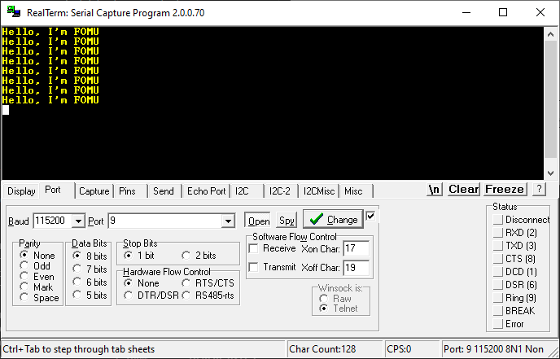
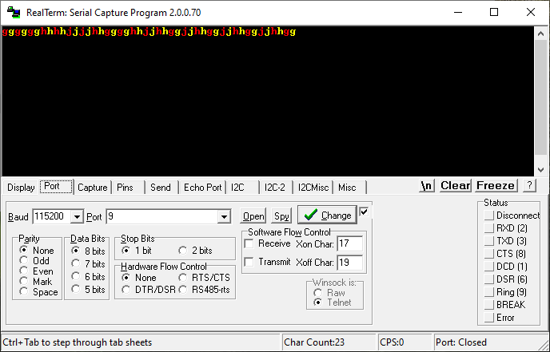

# Fomu examples.
These are *top design* FOMU examples with usb-serial converter.
For build these examples you need accesible 'fomu-toolchain' binaries in PATH.

## 'hello_world' example.
To sintetize this example only need to type
```bash
$ make PROJECT=hello_world
```
for upload to FOMU do
```bash
$ make PROJECT=hello_world load
```
In this example a green led blinking and show a message **"Hello, I'm FOMU"** in a serial terminal (with 115200 bauds).




## 'uart_echo' example.
To sintetize this example only need to type
```bash
$ make PROJECT=uart_echo
```
for upload to FOMU do
```bash
$ make PROJECT=uart_echo load
```
In this example a red led blinking and you can see a echo of keyboard press key in a serial terminal (with 115200 bauds).


